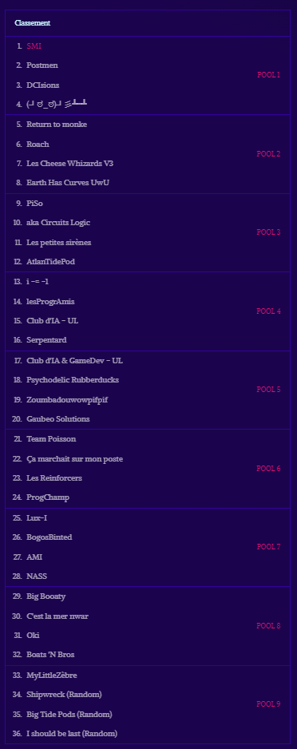
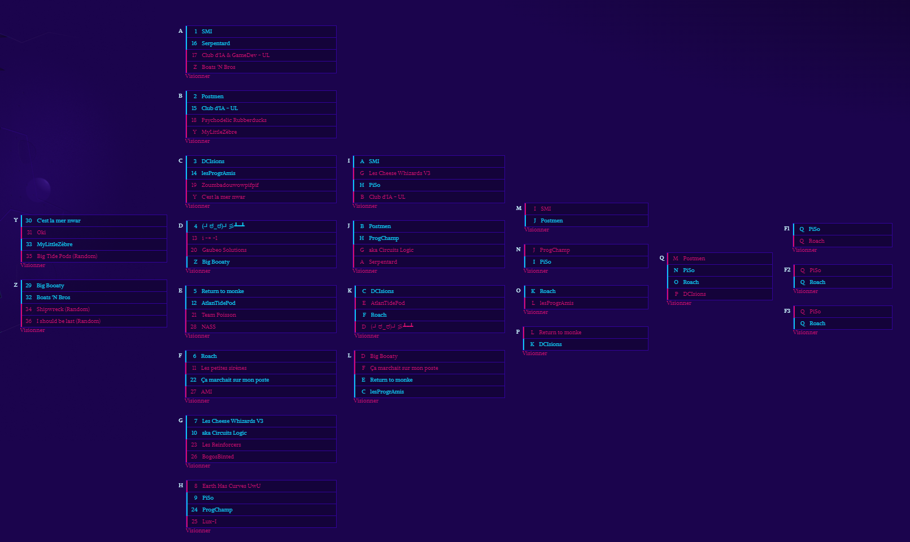

# Coveo Blitz 2023

Compétition de programmation d'agent d'une durée de 10 heures. L'agent a été écrit en C# par l'équipe **SMI** :

[Benjamin Courchesne](https://github.com/Capucinoxx)  
Étienne Dagenais   
[Xavier Lemieux](https://github.com/dovakin7)  
[Jacty Saenz](https://github.com/jactymilena)

## Mise en situation de la compétition
Cette année, Coveo Blitz vous amène à compétitionner dans un jeu de tours de défense contre d'autres équipes. Construisez des tours pour défendre votre civilisation contre des vagues de troupes hostiles envoyées par le jeu et par vos adversaires avant qu'elles arrivent au bout d’un parcours, tout en envoyant vous-même vos troupes pour vaincre la compétition.

## Positionnement
### **Première** position lors du classement de fin de journée 

### Classement lors de la finale
